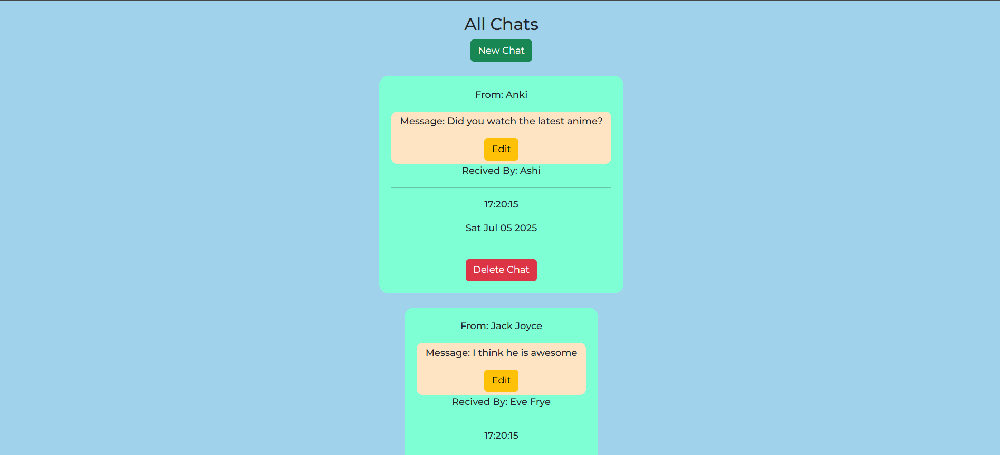

# Chat App (Express + MongoDB)

A simple chat interface built with Node.js, Express, MongoDB, EJS, and Bootstrap.

## Features

- Create, Read, Update, Delete chat messages
- SweetAlert confirmation on delete/submit
- MongoDB for persistent storage

## Run Locally

```bash
npm install
node index.js
```
Vist: http://localhost:3000/chats

## Preview


